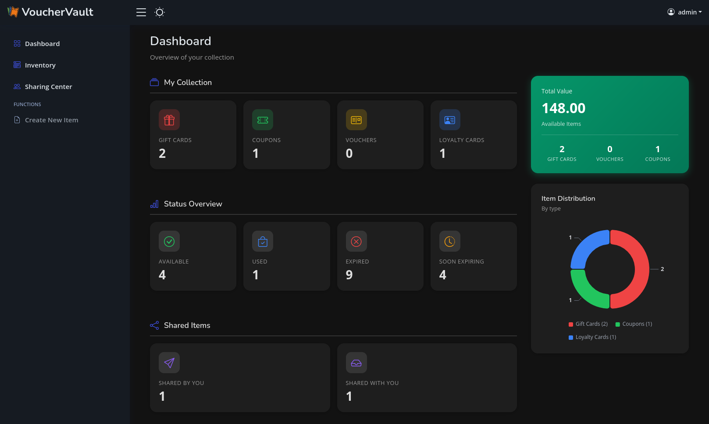
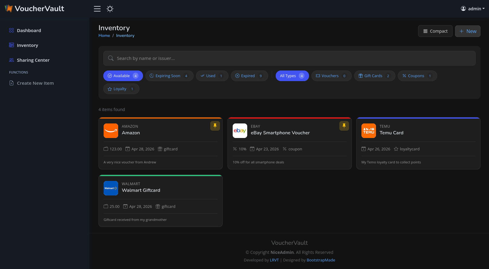
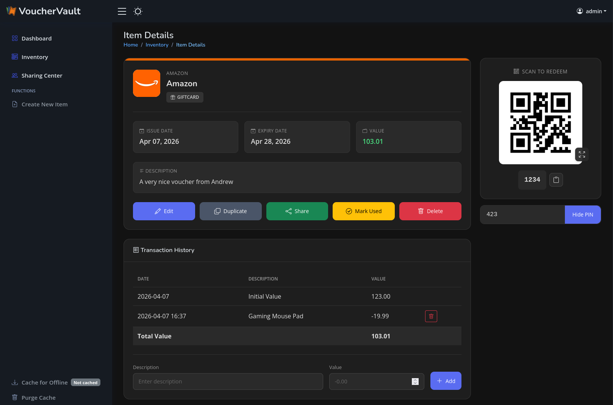

<div align="center" width="100%">
    <h1>VoucherVault</h1>
    
    <p>Django web application to store and manage vouchers, coupons, loyalty and gift cards digitally</p><p>
    <a target="_blank" href="https://github.com/l4rm4nd"></a>
    <a target="_blank" href="https://GitHub.com/l4rm4nd/VoucherVault/graphs/contributors/"></a>
    <a target="_blank" href="https://github.com/PyCQA/bandit"></a><br>
    <a target="_blank" href="https://GitHub.com/l4rm4nd/VoucherVault/commits/"></a>
    <a target="_blank" href="https://GitHub.com/l4rm4nd/VoucherVault/issues/"></a>
    <a target="_blank" href="https://github.com/l4rm4nd/VoucherVault/issues?q=is%3Aissue+is%3Aclosed"></a><br>
        <a target="_blank" href="https://github.com/l4rm4nd/VoucherVault/stargazers"></a>
    <a target="_blank" href="https://github.com/l4rm4nd/VoucherVault/network/members"></a>
    <a target="_blank" href="https://github.com/l4rm4nd/VoucherVault/watchers"></a><br>
    <a target="_blank" href="https://hub.docker.com/r/l4rm4nd/vouchervault"></a><br><p>
    <a href="https://www.buymeacoffee.com/LRVT" target="_blank"></a>
</div>

## ⭐ Features

- User-friendly, mobile-optimized web portal
- Light and dark theme support
- Integration of vouchers, coupons, gift cards and loyalty cards
- Transaction history tracking (gift cards only)
- Item-specific file uploads (images and PDFs)
- Item sharing between users
- Display of redeem codes as QR codes or barcodes (many types supported)
- Client-side redeem code scanning (1D/2D) during item creation with automatic type detection
- Expiry notifications via Apprise
- Multi-user support
- Multi-language support (English, German, French, Italian)
- Single Sign-On (SSO) via OIDC
- Database compatibility with SQLite3 and PostgreSQL
- REST API endpoint with stats for Home Assisstant (HA) and other dashboards

## 📷 Screenshots

<details>



</details>

## 🐳 Usage

[READ THE WIKI](https://github.com/l4rm4nd/VoucherVault/wiki/01-%E2%80%90-Installation) - [UNRAID SUPPORTED](https://github.com/l4rm4nd/VoucherVault/wiki/01-%E2%80%90-Installation#unraid-installation)

````
# create volume dir for persistence
mkdir -p ./volume-data/database

# adjust volume ownership to www-data
sudo chown -R 33:33 volume-data/*

# spawn the container stack
docker compose -f docker/docker-compose-sqlite.yml up -d
````

Once the container is up and running, you can access the web portal at http://127.0.0.1:8000. 

The default username is `admin`. The default password is auto-generated. You can obtain the auto-generated password via the Docker container logs:

````
docker compose -f docker/docker-compose-sqlite.yml logs -f
````

> [!WARNING]
> The container runs as low-privileged `www-data` user with UID/GID `33`. So you have to adjust the permissions for the persistent database bind mount volume. A command like `sudo chown -R 33:33 <path-to-volume-data-dir>` should work. Afterwards, please restart the container.

> [!TIP]
> This repository follows the Conventional Commits standard. Therefore, you will find `patch`, `minor` and `major` release version tags on DockerHub.
> No one stops you from using the `latest` image tag but I recommend pinning a minor version series tag such as `1.14.x`.
>
> This is safer for automatic upgrades and you still get recent patches as well as bug fixes.

## 🌍 Environment Variables

The docker container takes various environment variables:

| Variable                         | Description                                                                                                     | Default                    | Optional/Mandatory  |
|----------------------------------|-----------------------------------------------------------------------------------------------------------------|----------------------------|---------------------|
| `DOMAIN`                         | Your Fully Qualified Domain Name (FQDN) or IP address. Used to define `ALLOWED_HOSTS` and `CSRF_TRUSTED_ORIGINS` for the Django framework. May define multiple ones by using a comma as delimiter. | `localhost` | Mandatory           |
| `SECURE_COOKIES`                 | Set to `True` if you use a reverse proxy with TLS. Enables the `secure` cookie flag and `HSTS` HTTP response header. | `False`               | Optional            |
| `SESSION_EXPIRE_AT_BROWSER_CLOSE`| Set to `False` if you want to keep sessions valid after browser close.                                          | `True`                     | Optional            |
| `SESSION_COOKIE_AGE`             | Define the maximum cookie age in minutes.                                                                       | `30`                       | Optional            |
| `EXPIRY_THRESHOLD_DAYS`          | Defines the days prior item expiry when an Apprise expiry notification should be sent out.                      | `30`                       | Optional            |
| `EXPIRY_LAST_NOTIFICATION_DAYS`          | Defines the days prior item expiry when another final Apprise expiry notification should be sent out.                      | `7`                       | Optional            |
| `TZ`                             | Defines the `TIME_ZONE` variable in Django's settings.py.                                                       | `Europe/Berlin`            | Optional            |
| `SECRET_KEY`                     | Defines a fixed secret key for the Django framework. If missing, a secure secret is auto-generated on the server-side each time the container starts. | `<auto-generated>`         | Optional            |
| `PORT`                           | Defines a custom port. Used to set `CSRF_TRUSTED_ORIGINS` in conjunction with the `DOMAIN` environment variable for the Django framework. Only necessary, if VoucherVault is operated on a different port than `8000`, `80` or `443`. | `8000`                     | Optional            |
| `REDIS_URL`                      | Defines the Redis URL to use for Django-Celery-Beat task processing.                                            | `redis://redis:6379/0`     | Optional            |
| `CSP_FRAME_ANCESTORS`            | Comma-separated list of allowed sources for the CSP `frame-ancestors` directive.                                | `'none'`                   | Optional            |
| `OIDC_ENABLED`                   | Set to `True` to enable OIDC authentication.                                                                    | `False`                    | Optional            |
| `OIDC_AUTOLOGIN`                 | Set to `True` if you want to automatically trigger OIDC flow on login page                                      | `False`                    | Optional            |
| `OIDC_CREATE_USER`               | Set to `True` to allow the creation of new users through OIDC.                                                  | `True`                     | Optional            |
| `OIDC_RP_SIGN_ALGO`              | The signing algorithm used by the OIDC provider (e.g., RS256, HS256).                                           | `HS256`                    | Optional            |
| `OIDC_OP_JWKS_ENDPOINT`          | URL of the JWKS endpoint for the OIDC provider. Mandatory if `RS256` signing algo is used.                      | `None`                     | Optional            |
| `OIDC_RP_CLIENT_ID`              | Client ID for your OIDC RP.                                                                                     | `None`                     | Optional            |
| `OIDC_RP_CLIENT_SECRET`          | Client secret for your OIDC RP.                                                                                 | `None`                     | Optional            |
| `OIDC_OP_AUTHORIZATION_ENDPOINT` | Authorization endpoint URL of the OIDC provider.                                                                | `None`                     | Optional            |
| `OIDC_OP_TOKEN_ENDPOINT`         | Token endpoint URL of the OIDC provider.                                                                        | `None`                     | Optional            |
| `OIDC_OP_USER_ENDPOINT`          | User info endpoint URL of the OIDC provider.                                                                    | `None`                     | Optional            |
| `DB_ENGINE`                      | Database engine to use (e.g., `postgres` for PostgreSQL or `sqlite3` for SQLite3).                              | `sqlite3`                  | Optional            |
| `POSTGRES_HOST`                  | Hostname for the PostgreSQL database.                                                                           | `db`                       | Optional            |
| `POSTGRES_PORT`                  | Port number for the PostgreSQL database.                                                                        | `5432`                     | Optional            |
| `POSTGRES_USER`                  | PostgreSQL database user.                                                                                       | `vouchervault`             | Optional            |
| `POSTGRES_PASSWORD`              | PostgreSQL database password.                                                                                   | `vouchervault`             | Optional            |
| `POSTGRES_DB`                    | PostgreSQL database name.                                                                                       | `vouchervault`             | Optional            |

You can find detailed instructions on how to setup OIDC SSO in the [wiki](https://github.com/l4rm4nd/VoucherVault/wiki/02-%E2%80%90-Authentication#oidc-authentication).

## 🔔 Notifications

Notifications are handled by [Apprise](https://github.com/caronc/apprise). May read the [wiki](https://github.com/l4rm4nd/VoucherVault/wiki/03-%E2%80%90-Notifications).

You can define custom Apprise URLs in the user profile settings. The input form takes a single or a comma-separated list of multiple Apprise URLs.

The interval, how often items are checked against a potential expiry, is pre-defined (daily at 9AM) in the Django admin area. Here, we are utilizing Django-Celery-Beat + a Redis instance for periodic task execution.

An item will trigger an expiry notification if the expiry date is within the number of days defined by the environment variable `EXPIRY_THRESHOLD_DAYS`. By default, this threshold is set to 30 days. Additionally, a final reminder is sent out another time if the item expires within the next 7 days.

## 🔐 Multi-User Setup

VoucherVault is initialized with a default superuser account named `admin` and a secure auto-generated password. 

This administrative account has full privileges to the Django admin panel, located at `/admin`. 

Therefore, all database model entries can be read and modified by this user. Additionally, new user accounts and groups can be freely created too. 

Finally, Single-Sign-On (SSO) via OIDC is supported. Check out the environment variables above as well as the [wiki](https://github.com/l4rm4nd/VoucherVault/wiki/02-%E2%80%90-Authentication#oidc-authentication).

## 💾 Backups

All application data is stored within a Docker bind mount volume. 

This volume is defined in the example Docker Compose files given. The default location is defined as `./volume-data/database`.

Therefore, by backing up this bind mount volume, all your application data is saved.

> [!WARNING]
> Read the official [SQLite3 documentation](https://sqlite.org/backup.html) or [PostgreSQL documentation](https://www.postgresql.org/docs/current/backup.html) regarding backups.

## 🤖 Repo Statistics


